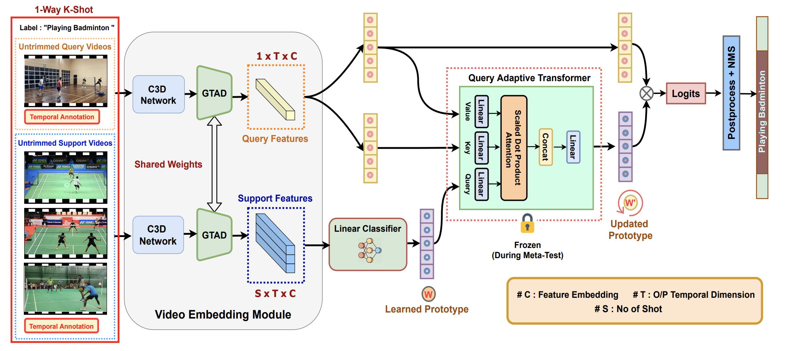
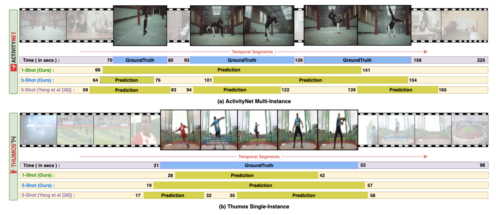

[](https://paperswithcode.com/sota/few-shot-temporal-action-localization-on?p=few-shot-temporal-action-localization-with)
[](https://paperswithcode.com/sota/few-shot-temporal-action-localization-on-1?p=few-shot-temporal-action-localization-with)

# FS-QAT: Few Shot Temporal Action Localization using Query Adaptive Transformer

**Accepted as Poster in BMVC 2021**

This is an official implementation in PyTorch of FS-QAT. Our paper is available at [Arxiv](https://arxiv.org/abs/2110.10552). Slides for the online presentation are now available at [Slides](https://github.com/sauradip/fewshotQAT/blob/main/BMVC21.pdf)



## Updates
- (October, 2021) C3D Features can be downloaded from [ActivityNet](http://activity-net.org/challenges/2016/download.html) website.
- (October, 2021) We released FS-QAT training and inference code (Reproducable) for ActivityNet dataset.
- (October, 2021) FS-QAT is accepted in BMVC2021.

## Abstract
Existing temporal action localization (TAL) works rely on a large number of training videos with exhaustive segment-level annotation, preventing them from scaling to new classes. As a solution to this problem, few-shot TAL (FS-TAL) aims to adapt a model to a new class represented by as few as a single video. Exiting FS-TAL methods assume trimmed training videos for new classes. However, this setting is not only unnatural – actions are typically captured in untrimmed videos, but also ignores background video segments containing vital contextual cues for foreground action segmentation. In this work, we first propose a new FS-TAL setting by proposing to use untrimmed training videos. Further, a novel FS-TAL model is proposed which maximizes the knowledge transfer from training classes whilst enabling the model to be dynamically adapted to both the new class and each video of that class simultaneously. This is achieved by introducing a query adaptive Transformer in the model. Extensive experiments on two action localization benchmarks demonstrate that our method can outperform all the stateof-the-art alternatives significantly in both single-domain and cross-domain scenarios.

## Summary
- First Few-Shot TAL setting to use Untrimmed Videos for both Support and Query 
- Unified Model can accomodate both Untrimmed and Trimmed Video without design change
- Instead of meta-learning the entire network, only Transformer is meta-learned hence faster adaptation.
- Intra-Class Variance is handled using this adaptation
- Promising performance in Cross-Domain/Dataset settings.
- Can localize Actions for a class having a minimum of just **1** annotated video

## Qualitative Performance



## Training and Evaluation

Appologize for the messed up Code

Refactoring will be done soon ( delay due to CVPR workload )

> To Train GTAD with base class split run this ( only needed once per dataset )

```train 
python gtad_train_fs.py 
```

> To Train on support split and Test on query split run this

```test
python gtad_inference_fs_inductive.py --meta_learn True --shot 5 --multi_instance False
python gtad_inference_fs_inductive.py --meta_learn False --shot 5 --multi_instance False
python gtad_c3d_postprocess_fs.py
```

## Few Shot Split Setting 

1. The Class Split is given as follows :
* Base CLass --> 160 Class
```bash
['Fun sliding down', ' Beer pong', ' Getting a piercing', ' Shoveling snow', ' Kneeling', ' Tumbling', ' Playing water polo', ' Washing dishes', ' Blowing leaves', ' Playing congas', ' Making a lemonade', ' Playing kickball', ' Removing ice from car', ' Playing racquetball', ' Swimming', ' Playing bagpipes', ' Painting', ' Assembling bicycle', ' Playing violin', ' Surfing', ' Making a sandwich', ' Welding', ' Hopscotch', ' Gargling mouthwash', ' Baking cookies', ' Braiding hair', ' Capoeira', ' Slacklining', ' Plastering', ' Changing car wheel', ' Chopping wood', ' Removing curlers', ' Horseback riding', ' Smoking hookah', ' Doing a powerbomb', ' Playing ten pins', ' Getting a haircut', ' Playing beach volleyball', ' Making a cake', ' Clean and jerk', ' Trimming branches or hedges', ' Drum corps', ' Windsurfing', ' Kite flying', ' Using parallel bars', ' Doing kickboxing', ' Cleaning shoes', ' Playing field hockey', ' Playing squash', ' Rollerblading', ' Playing drums', ' Playing rubik cube', ' Sharpening knives', ' Zumba', ' Raking leaves', ' Bathing dog', ' Tug of war', ' Ping-pong', ' Using the balance beam', ' Playing lacrosse', ' Scuba diving', ' Preparing pasta', ' Brushing teeth', ' Playing badminton', ' Mixing drinks', ' Discus throw', ' Playing ice hockey', ' Doing crunches', ' Wrapping presents', ' Hand washing clothes', ' Rock climbing', ' Cutting the grass', ' Wakeboarding', ' Futsal', ' Playing piano', ' Baton twirling', ' Mooping floor', ' Triple jump', ' Longboarding', ' Polishing shoes', ' Doing motocross', ' Arm wrestling', ' Doing fencing', ' Hammer throw', ' Shot put', ' Playing pool', ' Blow-drying hair', ' Cricket', ' Spinning', ' Running a marathon', ' Table soccer', ' Playing flauta', ' Ice fishing', ' Tai chi', ' Archery', ' Shaving', ' Using the monkey bar', ' Layup drill in basketball', ' Spread mulch', ' Skateboarding', ' Canoeing', ' Mowing the lawn', ' Beach soccer', ' Hanging wallpaper', ' Tango', ' Disc dog', ' Powerbocking', ' Getting a tattoo', ' Doing nails', ' Snowboarding', ' Putting on shoes', ' Clipping cat claws', ' Snow tubing', ' River tubing', ' Putting on makeup', ' Decorating the Christmas tree', ' Fixing bicycle', ' Hitting a pinata', ' High jump', ' Doing karate', ' Kayaking', ' Grooming dog', ' Bungee jumping', ' Washing hands', ' Painting fence', ' Doing step aerobics', ' Installing carpet', ' Playing saxophone', ' Long jump', ' Javelin throw', ' Playing accordion', ' Smoking a cigarette', ' Belly dance', ' Playing polo', ' Throwing darts', ' Roof shingle removal', ' Tennis serve with ball bouncing', ' Skiing', ' Peeling potatoes', ' Elliptical trainer', ' Building sandcastles', ' Drinking beer', ' Rock-paper-scissors', ' Using the pommel horse', ' Croquet', ' Laying tile', ' Cleaning windows', ' Fixing the roof', ' Springboard diving', ' Waterskiing', ' Using uneven bars', ' Having an ice cream', ' Sailing', ' Washing face', ' Knitting', ' Bullfighting', ' Applying sunscreen', ' Painting furniture', ' Grooming horse', ' Carving jack-o-lanterns']
```
* Validation Class ( Support ) --> 20 Class
```bash
['Swinging at the playground', ' Dodgeball', ' Ballet', ' Playing harmonica', ' Paintball', ' Cumbia', ' Rafting', ' Hula hoop', ' Cheerleading', ' Vacuuming floor', ' Playing blackjack', ' Waxing skis', ' Curling', ' Using the rowing machine', ' Ironing clothes', ' Playing guitarra', ' Sumo', ' Putting in contact lenses', ' Brushing hair', ' Volleyball']
```
* Testing Class ( Query ) --> 20 Class
```bash
['Hurling', ' Polishing forniture', ' BMX', ' Riding bumper cars', ' Starting a campfire', ' Walking the dog', ' Preparing salad', ' Plataform diving', ' Breakdancing', ' Camel ride', ' Hand car wash', ' Making an omelette', ' Shuffleboard', ' Calf roping', ' Shaving legs', ' Snatch', ' Cleaning sink', ' Rope skipping', ' Drinking coffee', ' Pole vault']
```


## Citation
If you find this project useful for your research, please use the following BibTeX entry.
```
@misc{nag2021fewshot,
      title={Few-Shot Temporal Action Localization with Query Adaptive Transformer}, 
      author={Sauradip Nag and Xiatian Zhu and Tao Xiang},
      year={2021},
      eprint={2110.10552},
      archivePrefix={arXiv},
      primaryClass={cs.CV}
}
```
